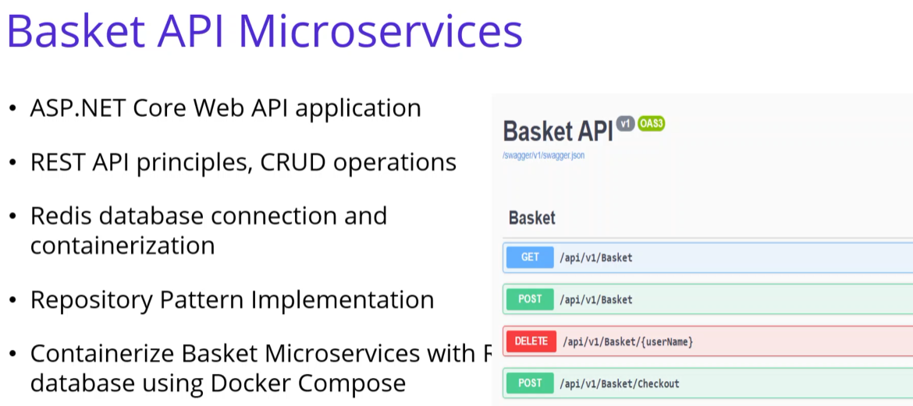

# Microservices

TODO: Massive re-org and cleanup of this readme


What are microservices?

1. Small business services
1. Can work together
1. Can be deployed independently
1. Communicate w/ each other
1. Technology agnostic


## Big Picture


# Monolithic vs Microservice

## Monolithic Pro-Con


## Microservice Pro-Con


## Deployment Comparison


# Docker and Docker Compose

1. Rebuild
   ```cmd
   docker-compose -f docker-compose.yml -f docker-compose.override.yml up --build
   ```

# Catalog API - MongoDB

- localhost:8000
  - When running from docker

## Catalog Design and Architecture


### Endpoints


### Layered Architecture


### Repository Pattern


## MongoDB Setup

We are going to set up mongo in our docker environment

1. [Official Docker Image](https://hub.docker.com/_/mongo)
1. Install mongo on Docker
   ```ps1
   docker pull mongo
   ```
   ```ps1
   docker run -d -p 27017:27107 --name shopping-mongo mongo
   ```
   - Port forwarding (check my docker repo for more info)
1. Run commands inside mongo docker container
   - To create tables, etc, everything you can do on mongodb
   ```ps1
   docker exec -it shopping-mongo /bin/bash
   ```
1. Hooking mongo up to .net
   - [MongoDB.Driver](https://www.nuget.org/packages/MongoDB.Driver/) Nuget package
1. [MongoClient](https://hub.docker.com/r/mongoclient/mongoclient)
   ```ps1
   docker run -d -p 3000:3000 mongoclient/mongoclient
   ```
   - Gives us a GUI for our mongo db
   - Best part, it's ran from docker just like the db

## Mongo CLI Commands

Run this command to connect to mongo docker image

```ps1
docker exec -it shopping-mongo /bin/bash
```

1. This will have you running linux commands from w/i the docker image (which is a linux image)
1. Simply type `mongo` to enter the mongo db cli
1. Show databases
   ```js
   show dbs
   ```
1. Create new database
   ```js
   use CatalogDb
   ```
   ```js
   db.createCollection('Products');
   ```
1. Insert many items
   ```mongo
   db.Products.insertMany([{}, {}])
   ```
1. There are more, check the `mongo-commands.txt` in the `Services\Catalog` folder

# Basket.API - Redis

- localhost:8001
  - When running from docker

## Basket Design and Architecture



### Endpoints


### Layered Architecture


## Redis

We will be using redis in the basket api

1. Open-source NoSQL database
1. Remote Dictionary server
1. Key-value pairs
1. Data Structure Server
1. Extremely fast
1. Save data both on RAM and on disk

## Redis Setup

1. [Docker Image](https://hub.docker.com/_/redis)
   ```ps1
   docker pull redis
   ```
1. Docker run command
   ```ps1
   docker run -d -p 6379:6379 --name aspnetrun-redis redis
   ```
1. Get inside redis image
   ```ps1
   docker exec -it aspnetrun-redis /bin/bash
   ```
1. Hook .net up to redis
   - [Nuget Package](https://www.nuget.org/packages/Microsoft.Extensions.Caching.StackExchangeRedis/)

## Redis CLI

```bash
redis-cli
ping

set key value
get key
set name mehmet
get name
```

## Test Data

```json
{
	"userName": "ghake",
	"items": [
		{
			"quantity": 2,
			"color": "Red",
			"price": 500,
			"productId": "123456789",
			"productName": "IPhone X"
		},
		{
			"quantity": 1,
			"color": "Blue",
			"price": 500,
			"productId": "123456788",
			"productName": "Samsung 10"
		}
	]
}
```

# Portainer

- [Documentation](https://docs.portainer.io/v/ce-2.11/start/intro)
- [Docker Image](https://hub.docker.com/r/portainer/portainer-ce)

1. Manage container-based software applications
1. k8s, docker, docker swarm, azure aci, and edge
1. Manage environments, deploy apps, monitor app performance, triage problems
1. localhost:9000
   - When running from docker

# Discount API - Postgres

## PostgreSQL

1. [Docker Image](https://hub.docker.com/_/postgres)
   ```ps1
   docker run --name some-postgres -e POSTGRES_PASSWORD=mysecretpassword -d postgres
   ```
1. But we will use docker-compose from the beginning
1. Using pgAdmin (from of course docker)
   - [Link](https://hub.docker.com/r/dpage/pgadmin4)
   - localhost:5050 when running from docker
1. Creating a DiscountServer (server) and DiscountDb (database)
1. [Nuget Package](https://www.nuget.org/packages/Npgsql/)
   - Npgsql

# Discount gRPC for Microservices Grpc Communication

## gRPC


- [gRPC vs Rest](https://cloud.google.com/blog/products/api-management/understanding-grpc-openapi-and-rest-and-when-to-use-them)

# Ordering Microservice with Clean Arch and CQRS

1. Using [SendGrid](https://docs.sendgrid.com/for-developers/sending-email/email-api-quickstart-for-c) to send emails

## Overview


## Architecture


## CQRS and Domain Driven Design Overview


## Domain Driven Design


## Mediator Design Pattern


- Install MediatR package
  ```cmd
  Install-Package MediatR.Extensions.Microsoft.DependencyInjection
  ```

## Ordering API EF and SQLServer Setup

1. Create the database migration in the Ordering.Infrastructure project
   ```cmd
   Add-Migration InitialCreate
   ```
   - Creates our initial migration
1. SQL Server Docker
   - [Link](https://hub.docker.com/_/microsoft-mssql-server)
1. Everything else is defined in the code (docker and appsettings)

# Async Communication with RabbitMQ & MassTransit for Checkout

1. Message Queue System
1. Event-Driven Architecture
1. [Docker Image](https://hub.docker.com/_/rabbitmq)


## RabbitMQ Pub/Sub Architecture


- We'll be using Event Driven Architecture in our design

## RabbitMQ Exchange Types

1. Direct Exchanges
1. Topic Exchanges
1. Fanout Exchanges
1. Header Exchanges

# API Gateways with Ocelot and Gateways Routing Pattern


## Ocelot API Gateway

[Official Docs](https://ocelot.readthedocs.io/en/latest/features/routing.html)

1. Lightweight API Gateway
1. .net Core based API Gateway
1. Open Source
1. Fast and Scalable
1. Can deploy with the rest of our code
1. Ocelot will get tokens and attach to requests for other

## Ocelot Authentication


# Local App Links

TODO Put links of local apps when running from docker

1. [Portainer](http://localhost:9000/#!/home)
   - admin
   - admin1234
1. [Catalog API](http://localhost:8000/swagger/index.html)
1. [Basket API](http://localhost:8001/swagger/index.html)
1. [Ordering API](http://localhost:8004/swagger/index.html)
1. [RabbitMQ](http://localhost:15672/)
   - guest
   - guest
